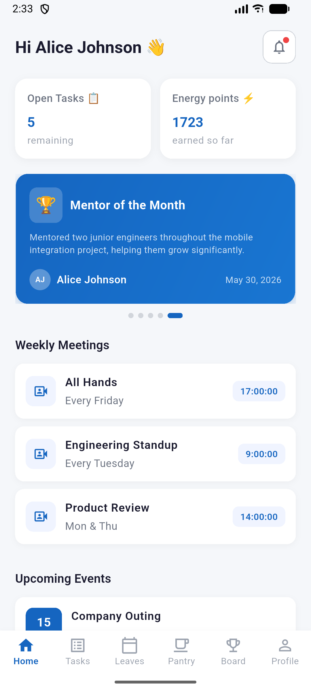
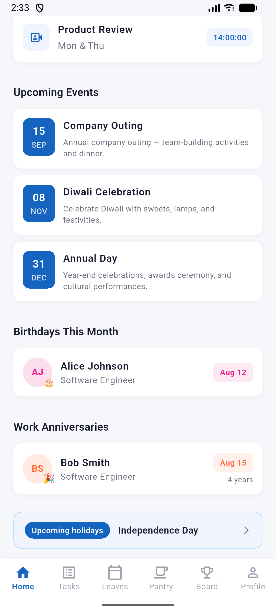
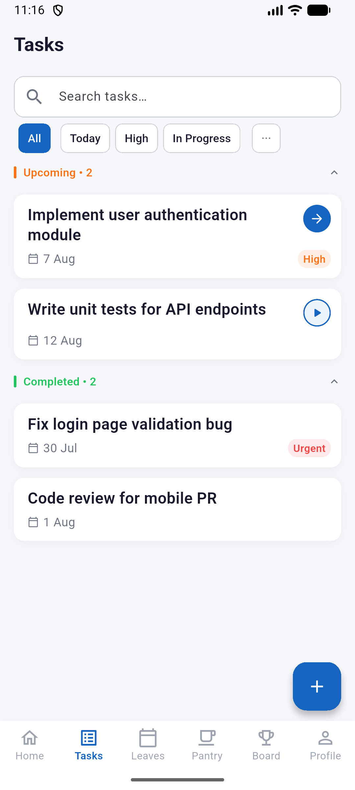
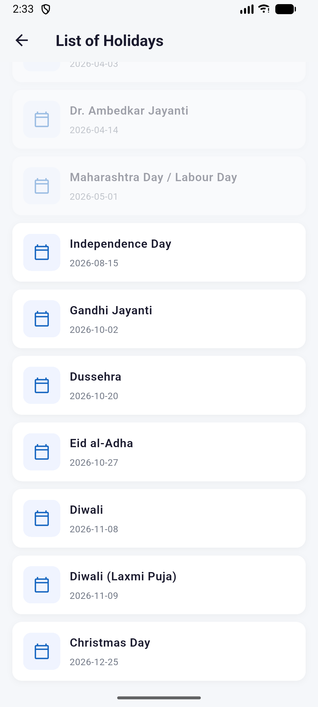
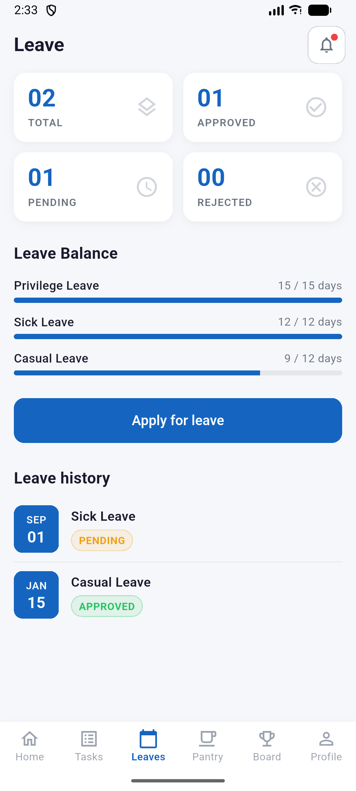
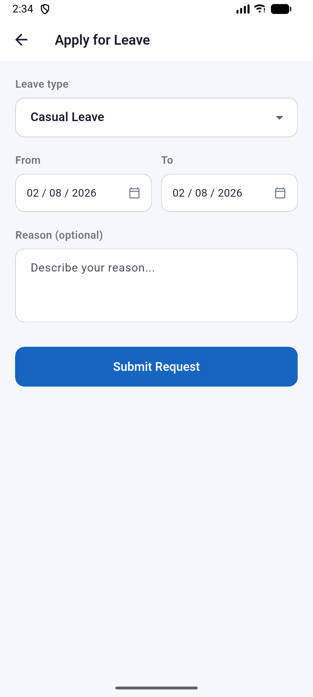
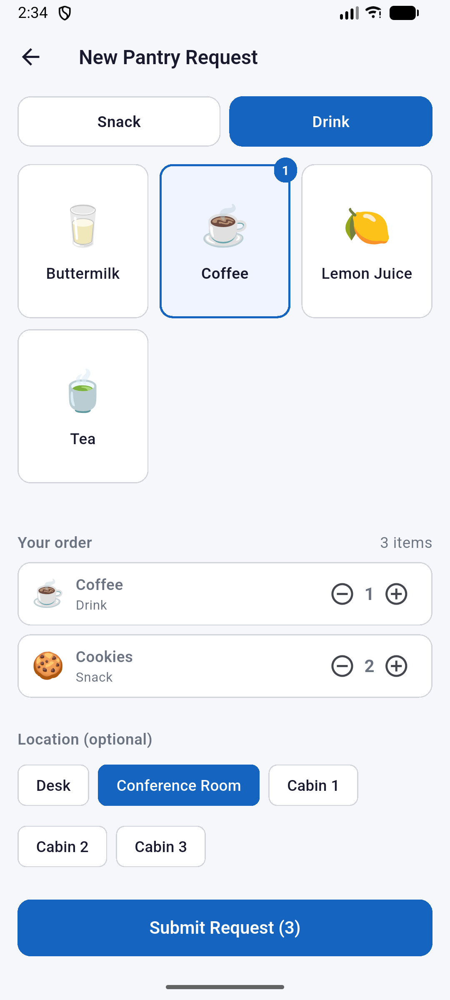
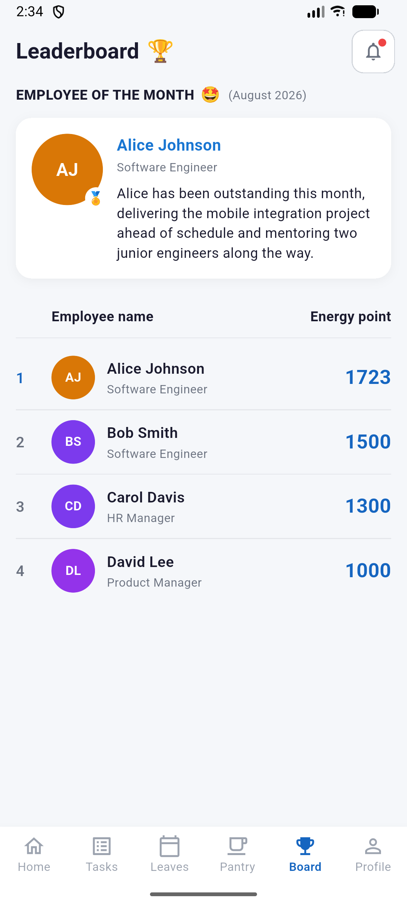

# Standup — Your Company in Your Pocket

<p align="center">
  
</p>

Standup is a mobile-first employee experience app that keeps everyone connected, informed, and engaged — from knowing who's on leave today to ordering a coffee from the pantry without leaving your desk.

Built on [Frappe/ERPNext](https://frappeframework.com/) with a Flutter mobile client, Standup surfaces the information employees actually need, without the noise of a full ERP dashboard.

---

## What Standup Does

### Home
A personalised daily briefing at a glance:
- **Energy points** and open task count
- **Achievements carousel** — recognise standout moments
- **Weekly meetings** — recurring syncs your team never wants to miss
- **Upcoming events** — company outings, celebrations, and all-hands
- **Birthdays this month** — never miss a colleague's birthday
- **Work anniversaries** — celebrate tenure milestones
- **Next public holiday** — so you can plan your long weekend

### Leave Management
- Check your remaining leave balance across Casual, Sick, and Privilege leave
- Apply for leave directly from the app
- Track the status of past applications — Approved, Pending, or Rejected

### Pantry
- Browse the snack and drinks catalog
- Place a request and choose your delivery location (desk, conference room, cabin)
- Pantry staff accept, reject, or complete requests in real time

### Leaderboard
- See who's leading on energy points this month
- Find out who's been named **Employee of the Month** and why

### Holidays
- Full company holiday calendar for the year
- Public holidays displayed in order so you always know what's coming

---

## Screenshots

<table>
  <tr>
    <td align="center"><b>Home</b></td>
    <td align="center"><b>Home (cont.)</b></td>
    <td align="center"><b>Tasks</b></td>
    <td align="center"><b>Holidays</b></td>
  </tr>
  <tr>
    <td></td>
    <td></td>
    <td></td>
    <td></td>
  </tr>
  <tr>
    <td align="center"><b>Leave</b></td>
    <td align="center"><b>Apply for Leave</b></td>
    <td align="center"><b>Pantry</b></td>
    <td align="center"><b>Leaderboard</b></td>
  </tr>
  <tr>
    <td></td>
    <td></td>
    <td></td>
    <td></td>
  </tr>
</table>

---

## Who It's For

| Role | What they get |
|---|---|
| **Employee** | Leave balance, leave applications, pantry orders, home feed |
| **Leave Approver** | Review and act on team leave requests |
| **HR Manager** | Full access to leave, employee data, and announcements |
| **Pantry Staff** | Dedicated queue to manage and fulfil snack requests |

---

## Tech Stack

| Layer | Technology |
|---|---|
| Backend | [Frappe](https://frappeframework.com/) v15 + [ERPNext](https://erpnext.com/) HRMS |
| Mobile | Flutter 3.22+ (iOS & Android) |
| Auth | Token-based (api_key + api_secret) via `flutter_secure_storage` |
| State | Riverpod |

---

## Getting Started

### Prerequisites

- Docker and Docker Compose (recommended for local development)
- Flutter SDK ≥ 3.22 (stable channel)
- Android Studio or Xcode for device simulators

### 1. Start the backend

```bash
docker compose up -d
bench --site site1.localhost execute standup.scripts.setup_sample_data.run
```

This brings up Frappe + MariaDB + Redis and seeds sample employees, leave data, pantry catalog, meetings, events, and more.

### 2. Run the Flutter app

```bash
cd app/standup
flutter pub get
flutter run
```

The Android emulator reaches the backend at `http://10.0.2.2:8080` by default. For a physical device on the same network, update `baseUrl` in `lib/core/constants/api_constants.dart`.

### 3. Log in

Use any of the seeded test accounts (password: `Test@1234`):

| Name | Email | Role |
|---|---|---|
| Alice Johnson | alice.johnson@example.com | Employee, Leave Approver |
| Bob Smith | bob.smith@example.com | Employee |
| Carol Davis | carol.davis@example.com | HR Manager, Leave Approver |
| David Lee | david.lee@example.com | Employee |
| Pantry Staff | pantry.staff@example.com | Pantry |

---

## Repository Layout

```
standup/                     ← Frappe app (Python package)
├── standup/
│   ├── api.py               ← All mobile REST endpoints
│   ├── hooks.py             ← App metadata, CORS, scheduler
│   └── standup/doctype/     ← Custom doctypes (Pantry, Meetings, Events…)
├── scripts/
│   └── setup_sample_data.py ← Idempotent seed script
└── app/standup/             ← Flutter mobile client
    └── lib/
        ├── core/            ← Services, theme, constants
        ├── data/            ← Models, mock data
        └── features/        ← Screens, widgets, providers per feature
```

---

## CI

| Pipeline | Triggers on | Checks |
|---|---|---|
| `frappe-tests.yml` | Changes to `standup/**` | bench install → run-tests → ruff lint |
| `flutter-tests.yml` | Changes to `app/**` | flutter test → android build |
